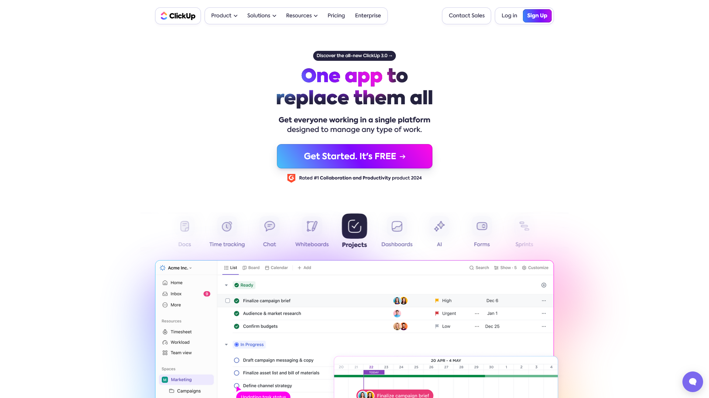
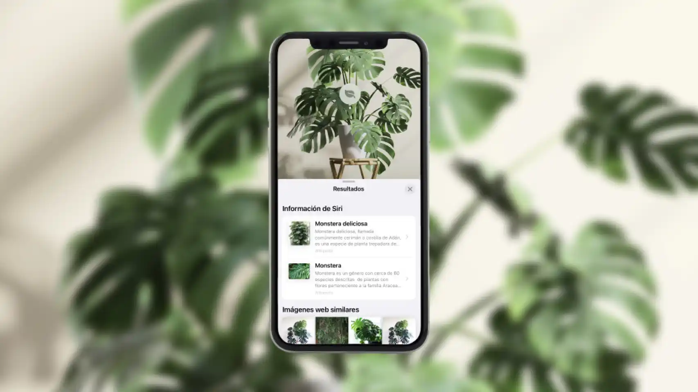

# PEC3: Visionando el futuro con las gafas de Manovich 

**Autor:** Marta Díez Casas &nbsp;&nbsp;&nbsp;&nbsp;&nbsp; **Fecha:** Marzo del 2024

 
<small>Fotografía de Lev Manovich. Fondo generado con Inteligencia Artificial. &nbsp; - &nbsp; _Fuente obra original: [Manovich](http://manovich.net/index.php/about)_.</small>

## ¿Qué es la «_hibridación de medios_»?

La **hibridación de medios**, según Lev Manovich en su libro _El software toma el mando_ (2013), es una etapa lógica de la evolución del **metamedio ordenador** en la que los diferentes medios empiezan a interaccionar y mutar hasta generar medios híbridos, es decir, nuevas combinaciones de medios nunca vistas hasta el momento.

### Comparación entre hibridez y multimedia

Muchos os estaréis preguntando si esto no es un caso multimedia, o qué diferencia hay entre estos dos conceptos. Pues bien, no en vano Manovich dedica un apartado para comparar ambos conceptos en el capítulo 3 de su libro —título que le tomo prestado para encabezar esta pequeña sección—. Si bien estos dos conceptos son muy similares y pueden llevar a confusión al lector, hay formas de diferenciarlos.

> [«Multimedia»] Este término se popularizó en los noventa para describir aplicaciones y documentos electrónicos en los que convivían, de forma contigua, distintos tipos de medios. [...] _La multimedia no amenaza la autonomía de los medios individuales. Conservan su propio lenguaje._ &nbsp; - &nbsp; (Manovich 2013)

Es decir, en la **multimedia**, los medios aparecen uno junto al otro y en ningún caso se combinan o se mezclan.

> Por contra, en los híbridos de medios, las interfaces, técnicas y en última instancia las presuposiciones más básicas de los diversos formatos y tradiciones de medios se unen y dan pie a nuevas gestalts de medios. 
Es decir, se fusionan para ofrecer una experiencia nueva y coherente [...] Los medios híbridos confluyen lenguajes previos y diferenciados, intercambian propiedades, crean nuevas estructuras e interaccionan a niveles más profundos. &nbsp; - &nbsp; (Manovich 2013)

Mientras que en la **hibridación** obtenemos un nuevo lenguaje fruto de la interacción de los medios que Manovich denomina _metalenguaje_.

### ¿La hibridación y la remediación son lo mismo?

Admito que son conceptos que confunden bastante. Durante mi estudio y la lectura del libro de Manovich _El software toma el mando_ (2013) me costó ver la diferencia ya que en esencia parecen ser lo mismo: ambos describen cómo los medios interactúan y evolucionan.

Si tenemos en cuenta que la **remediación** se centra en la adaptación y reinterpretación de un medio preexistente para crear un nuevo medio con nuevas propiedades y que la **hibridación** se puede dar en diferentes niveles: en la interacción con el medio, en el medio en sí o en ambos niveles. Podemos afirmar que la **remediación es un tipo de hibridación** en tanto en cuanto la estrategia de hibridación se da en el propio medio. Sin embargo, no podemos olvidar que el concepto de hibridación es mucho más amplio.

Una vez aclarados los términos, en este ensayo, mi intención es profundizar en el concepto de **hibridación** analizando de qué forma se produce dicha hibridación mediante el análisis de dos ejemplos modernos de este proceso de evolución como ClickUp, una aplicación de gestión de proyectos y Visual Look Up, un sistema de reconocimiento de plantas integrado en la aplicación Fotos de iPhone. 

## ClickUp, una aplicación para sustituirlas a todas

ClickUp es una herramienta de gestión de proyectos integral que ayuda a equipos y empresas a organizar y gestionar su trabajo de manera eficiente y colaborativa en una única aplicación en la nube.

Si tomamos prestado el eslogan de ClickUp “One app to replace them all” (una aplicación para reemplazarlas a todas) que ocupa gran parte de la portada de su página web, podemos intuir que es un excelente ejemplo de hibridación de medios.

<small>Captura de pantalla de la página web de ClickUp. &nbsp; - &nbsp; _Fuente: [ClickUp](https://clickup.com/)_.</small>

Si utilizamos el término **«medio»** como **«tipo específico de dato»** (Manovich 2013), podemos observar que en ClickUp conviven múltiples medios ya que permite a los usuarios incorporar texto, imágenes, videos, gráficos, y documentos en múltiples formatos dentro de tareas y proyectos. Sin embargo, si analizamos cómo se muestran los distintos medios dentro de una tarea, podemos hablar más de multimedia que de hibridación ya que a simple vista estos medios no parecen mezclarse ni combinarse. No obstante, si vamos más allá y nos centramos en la interfaz, podemos ver una de las **estrategias de hibridación** que identifica Manovich en su libro.

> Los híbridos pueden centrarse en _nuevas maneras de navegar e interaccionar con formatos de medios ya existentes_. En este tipo de medio en sí ni se modifica ni se combina con otros, sino que la hibridación se produce en la interfaz de usuario y las herramientas que facilita el proyecto, servicio o aplicación para trabajar con ese tipo de medios. &nbsp; - &nbsp; (Manovich 2013)

ClickUp integra diversas **interfaces de usuario**, como listas, tableros Kanban, diagramas de Gantt, calendarios y vistas de tablero de control (denominados _dashboard_) que permite a los usuarios interactuar con sus tareas y proyectos de maneras diferentes, según sus preferencias y necesidades específicas.

> Estos elementos están tremendamente integrados para ofrecer al usuario una nueva experiencia que no se reduzca simplemente a la suma de sus respectivos métodos de trabajo. &nbsp; - &nbsp; (Manovich 2013)

Por lo tanto, gracias a esta nueva experiencia, tal y como indica Manovich con su ejemplo de After Effects, podemos afirmar que la interfaz de ClickUp es un ejemplo de **«remezclabilidad profunda»** (Manovich 2013).

Asimismo, esta aplicación también combina herramientas de gestión de tareas, calendarios, comunicación en tiempo real, seguimiento del tiempo, y almacenamiento de documentos entre otros. Esta **mezcla de funcionalidades de diferentes medios** tradicionales (como calendarios físicos, correos electrónicos, hojas de cálculo) en una única interfaz digital ilustra a la perfección esta estratégia de la hibridación de medios.

La interfaz de usuario y esta remezcla de herramientas que se da en ClickUp ha acabado creando un nuevo lenguaje, o más bien dicho, un **«metalenguaje»** que condiciona y modifica el flujo de trabajo de los usuarios. Cualquier proyecto, tarea o documento que se cree en este medio híbrido puede utilizar todas las técnicas que quiera que antes eran exclusivas de cada medio (Manovich 2013).

## Re-descubriendo la hibridación mediante un sistema de reconocimiento de plantas

Una vez analizada la **hibridación** en una aplicación como ClickUp en la que hemos detectado una **hibridación profunda**. Vamos a analizar una funcionalidad específica integrada en una aplicación para discernir si es posible la **hibridación a diferentes niveles** como defiende Lev Manovich en su libro _El software toma el mando_ (2013). En concreto, vamos a analizar el sistema de reconocimiento de plantas integrado en la aplicación Fotos de iPhone.

Este sistema recibe el nombre de _Visual Look Up_ y no solo sirve para identificar una planta, sino que **permite reconocer y obtener información sobre elementos que aparecen dentro de una imagen** como obras de arte, monumentos, mascotas, insectos, flores, etc. Sin embargo, para este análisis nos centraremos únicamente en el reconocimiento de plantas.

<small>Mockup con los resultados ofrecidos por el sistema de reconocimeitno de plantas de iPhone. &nbsp; - &nbsp; _Fuente: [El Español](https://www.elespanol.com/vivir/ocio/20230524/increible-truco-identificar-plantas-camara-iphone/765923681_0.html)_.</small>

Su funcionamiento es muy sencillo: tomamos una foto, le damos al icono de información —siempre que esté acompañado de unas estrellas—, luego le damos a la opción “Consultar - Planta” que viene indicada con un icono de una hoja y automáticamente recibiremos información sobre ésta. Concretamente un listado de enlaces a Wikipedia con información referente a la planta fotografiada junto a imágenes similares que nos pueden servir para encontrar más información.

Visual Look Up combina un **medio** tradicional como es la imagen con algoritmos avanzados de procesamiento y análisis de imágenes, accede a extensos **«bancos de memoria informatizados»** (Huyssen 1986) que contienen información sobre miles de especies de plantas utilizando algoritmos de Inteligencia Artificial para comparar nuestra foto con las imágenes y los datos almacenados.

> Ahora todas las técnicas, formas e imágenes modernas y vanguardistas están guardadas en los bancos de memoria informatizados de nuestra cultura y podemos acceder a ellos al instante. &nbsp; - &nbsp; (Huyssen 1986)

En resumen, podemos decir que Visual Look Up es un claro ejemplo de **hibridación de medios** en base a la siguiente cita:

> [En la hibridación] Se agrupan técnicas y formatos de representación de medios físicos y electrónicos anteriores, y las nuevas técnicas de manipulación de la información y formatos de datos exclusivos del ordenador para formar nuevas combinaciones. &nbsp; - &nbsp; (Manovich 2013)

Es decir, Visual Look Up combina la imágen (formatos de representación de medios físicos y electrónicos anteriores) con algoritmos de procesamiento y análisis de imágenes (nuevas técnicas de manipulación de la información) para ofrecer una experiencia rica y multifacética a sus usuarios (nuevas combinaciones).

Por lo tanto, la **hibridación**, en este caso, no se da en un aspecto visual como el medio o la interfaz de usuario, sino que se da a un nivel más profundo, concretamente en los **datos**. Visual Look Up **integra datos de múltiples fuentes**, como bases de datos botánicas, información geolocalizada (GPS), y datos obtenidos de algoritmos de reconocimiento de imágenes y aprendizaje automático que permite proporcionar al usuario información explícita sobre la planta.

## Conclusión

Podemos afirmar que Lev Manovich está bien encaminado al hablar de la **hibridación de medios** como una **etapa de la evolución del metamedio ordenador**. 

> Traducidos al software, los diversos tipos de medios empezaron a actuar como especies en una ecología compartida; en este caso, un entorno de software compartido. Una vez «liberados» a este entorno, han empezado a interaccionar, mutar y producir híbridos. &nbsp; - &nbsp; (Manovich 2013)

Actualmente estamos sumergidos de lleno en esta **etapa de la evolución** en la que los medios se combinan, interaccionan y se remezclan para crear nuevos paradigmas que toman un papel fundamental en la **transformación digital** y, por ende, en nuestra **cultura digital**.

En este ensayo hemos abordado la **hibridación** en base a dos ejemplos muy distintos de híbridos que nos ha permitido corroborar que la hibridación se produce en **múltiples dimensiones**, nieveles y capas. Permitiendo un desarrollo a un nivel más general —sin quitarle profundidad a la hibridación— en la que los medios y las técnicas de interacción hibridan para formar un «todo» como es el caso de ClickUp. A la vez que hemos comprobado que la hibridación también se desarrolla a niveles más profundos o más concretos, como en los datos, que se agrupan para formar nuevas combinaciones que a su vez formarán parte de nuevos híbridos como es el caso de Visual Look Up.

## Referencias y Bibliografía
* ALBERICH-PASCUAL, Jordi. Elementos de la creatividad multimedia: apropiación,remediación, hibridación. En: _Mosaic_ [en línea]. 2018. [consulta: 20 de mayo de 2024]. Disponible en: https://www.researchgate.net/publication/322834908_Elementos_de_la_creatividad_multimedia_apropiacion_remediacion_hibridacion

* ALBERICH-PASCUAL, Jordi. Fundamentos y evolución de la multimedia. En: _Mosaic_ [en línea]. 2018. [consulta: 20 de mayo de 2024]. Disponible en: http://multimedia.uoc.edu/blogs/fem/es/remediacio-multimedia-i-hibridacio-dels-mitjans/

* BERNAL RASPALL, David. Identificar plantas, animales o monumentos gracias a la cámara de nuestro iPhone: si tienes iOS 16 así puedes hacerlo. En: _Applesfera_ [en línea]. 2023. [consulta: 25 de mayo de 2024]. Disponible en: https://www.applesfera.com/tutoriales/asi-podemos-identificar-cualquier-planta-gracias-a-camara-nuestro-iphone-apps-terceros

* _ClickUp™ | One app to replace them all_ [en línea] [fecha de consulta: 25 de mayo de 2024]. Disponible en: https://clickup.com/

* _ClickUp - Wikipedia_ [en línea] [fecha de consulta: 25 de mayo de 2024]. Disponible en: https://en.wikipedia.org/wiki/ClickUp

* EL ESPAÑOL. El increíble truco para identificar plantas con la cámara del iPhone. En: _El Español_ [en línea]. 2023. [consulta: 25 de mayo de 2024]. Disponible en: https://www.elespanol.com/vivir/ocio/20230524/increible-truco-identificar-plantas-camara-iphone/765923681_0.html

* _Estilo ISO 690_ [en línea] [fecha de consulta: 20 de mayo de 2024]. Disponible en: https://biblioteca.uoc.edu:8080/es/pagina/Estilo-ISO-690/

* HUYSSEN, Andreas. _After the Great Divide_. Bloomington e Indianapolis: Indiana University Press, 1986.

* _Look up what's in a photo with your iPhone or iPad - Apple Support_ [en línea] [fecha de consulta: 25 de mayo de 2024]. Disponible en: https://support.apple.com/en-us/104962

* MALAS, Faisal. Las diez mejores herramientas de gestión de proyectos en 2024 (funciones, ventajas y desventajas). En: Blog de ClickUp [en línea]. 2024. [consulta: 25 de mayo de 2024]. Disponible en: https://clickup.com/es/blog/mejores-herramientas-de-gestion-de-proyectos#:~:text=ClickUp%20es%20una%20herramienta%20de,entrega%20con%20la%20calidad%20esperada.

* MANOVICH, Lev. _El Software toma el mando_. Barcelona: Editorial UOC, 2013. 

* RUBIO, Francisco. ClickUp: qué es y para qué sirve. En:Expacio Web [en línea]. 2023. [consulta: 25 de mayo de 2024]. Disponible en: https://www.expacioweb.com/clickup-que-es-y-para-que-sirve/
